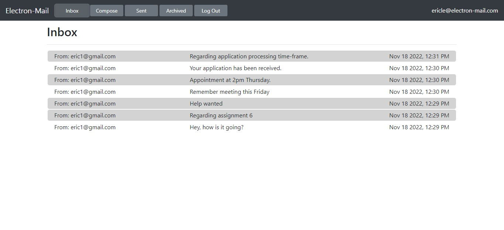

# Email

This SPA make use of Django API to get mail, send mail, and update emails.



## Getting Started

### Dependencies

To be able to use the program, you should install the following modules:

```
pip install django
```

### Installing

To download this program, enter the following command in your terminal:
```
git clone https://github.com/erichoangnle/email.git
```

## API

This application supports the following API routes:

#### GET /emails/<str:mailbox>

Sending a GET request to /emails/<mailbox> where <mailbox> is either inbox, sent, or 
archive will return back to you (in JSON form) a list of all emails in that mailbox, 
in reverse chronological order. For example, if you send a GET request to /emails/inbox, 
you might get a JSON response like the below (representing two emails):

```
[
    {
        "id": 100,
        "sender": "foo@example.com",
        "recipients": ["bar@example.com"],
        "subject": "Hello!",
        "body": "Hello, world!",
        "timestamp": "Jan 2 2020, 12:00 AM",
        "read": false,
        "archived": false
    },
    {
        "id": 95,
        "sender": "baz@example.com",
        "recipients": ["bar@example.com"],
        "subject": "Meeting Tomorrow",
        "body": "What time are we meeting?",
        "timestamp": "Jan 1 2020, 12:00 AM",
        "read": true,
        "archived": false
    }
]
```

Note also that if you request an invalid mailbox (anything other than inbox, sent, 
or archive), you’ll instead get back the JSON response {"error": "Invalid mailbox."}.

#### GET /emails/<int:email_id>

Sending a GET request to /emails/email_id where email_id is an integer id for an email 
will return a JSON representation of the email, like the below:

```
{
        "id": 100,
        "sender": "foo@example.com",
        "recipients": ["bar@example.com"],
        "subject": "Hello!",
        "body": "Hello, world!",
        "timestamp": "Jan 2 2020, 12:00 AM",
        "read": false,
        "archived": false
}
```

Note that if the email doesn’t exist, or if the user does not have access to the email, the 
route instead return a 404 Not Found error with a JSON response of {"error": "Email not found."}.

#### POST /emails

To send an email, you can send a POST request to the /emails route. The route requires three pieces 
of data to be submitted: a recipients value (a comma-separated string of all users to send an email to),
a subject string, and a body string. For example, you could write JavaScript code like:

```
fetch('/emails', {
  method: 'POST',
  body: JSON.stringify({
      recipients: 'baz@example.com',
      subject: 'Meeting time',
      body: 'How about we meet tomorrow at 3pm?'
  })
})
.then(response => response.json())
.then(result => {
    // Print result
    console.log(result);
});
```

If the email is sent successfully, the route will respond with a 201 status code and a JSON 
response of {"message": "Email sent successfully."}.

Note that there must be at least one email recipient: if one isn’t provided, the route will 
instead respond with a 400 status code and a JSON response of {"error": "At least one recipient 
required."}. All recipients must also be valid users who have registered on this particular web 
application: if you try to send an email to baz@example.com but there is no user with that email 
address, you’ll get a JSON response of {"error": "User with email baz@example.com does not exist."}.

#### PUT /emails/<int:email_id>

The final route that you’ll need is the ability to mark an email as read/unread or as archived/unarchived. 
To do so, send a PUT request (instead of a GET) request to /emails/<email_id> where email_id is the id of 
the email you’re trying to modify. For example, JavaScript code like:

```
fetch('/emails/100', {
  method: 'PUT',
  body: JSON.stringify({
      archived: true
  })
})
```

would mark email number 100 as archived. The body of the PUT request could also be {archived: false} to 
unarchive the message, and likewise could be either {read: true} or read: false} to mark the email as read 
or unread, respectively.

## Specification

### Send Mail

When a user submits the email composition form, use JavaScript code to actually send the email.
 * Make a POST request to /emails, passing in values for recipients, subject, and body.
 * Once the email has been sent, load the user’s sent mailbox.

### Mailbox

When a user visits their Inbox, Sent mailbox, or Archive, load the appropriate mailbox.
 * Make a GET request to /emails/<mailbox> to request the emails for a particular mailbox.
 * When a mailbox is visited, the application should first query the API for the latest emails in that mailbox.
 * When a mailbox is visited, the name of the mailbox should appear at the top of the page.
 * Each email should then be rendered in its own box (e.g. as a <div> with a border) that displays who the email 
 is from, what the subject line is, and the timestamp of the email.
 * If the email is unread, it should appear with a white background. If the email has been read, it should appear 
 with a gray background.

### View Email

When a user clicks on an email, the user should be taken to a view where they see the content of that email.
 * Make a GET request to /emails/<email_id> to request the email.
 * Application should show the email’s sender, recipients, subject, timestamp, and body.
 * Once the email has been clicked on, mark the email as read by sending a PUT request to /emails/<email_id> 
 to update whether an email is read or not.

### Archive and Unarchive

Allow users to archive and unarchive emails that they have received.
 * When viewing an Inbox email, the user should be presented with a button that lets them archive the email. 
 When viewing an Archive email, the user should be presented with a button that lets them unarchive the email. 
 * Once an email has been archived or unarchived, load the user’s inbox.
 
### Reply

Allow users to reply to an email.
 * When viewing an email, the user should be presented with a “Reply” button that lets them reply to the email.
 * When the user clicks the “Reply” button, they should be taken to the email composition form.
 * Pre-fill the composition form with the recipient field set to whoever sent the original email.
 * Pre-fill the subject line. If the original email had a subject line of foo, the new subject line 
 should be Re: foo. (If the subject line already begins with Re: , no need to add it again.)
 * Pre-fill the body of the email with a line like "On Jan 1 2020, 12:00 AM foo@example.com wrote:" followed 
 by the original text of the email.

## Contact

Email: erichoangnle@gmail.com

Facebook: https://www.facebook.com/eric.le.520900

Project link: https://github.com/erichoangnle/email.git
